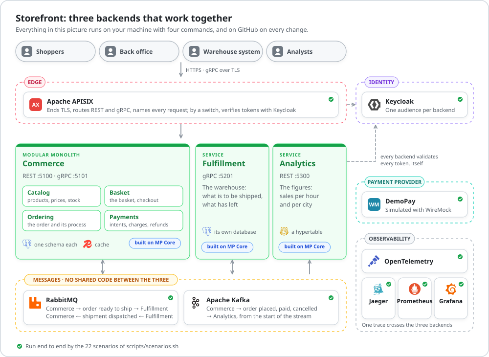
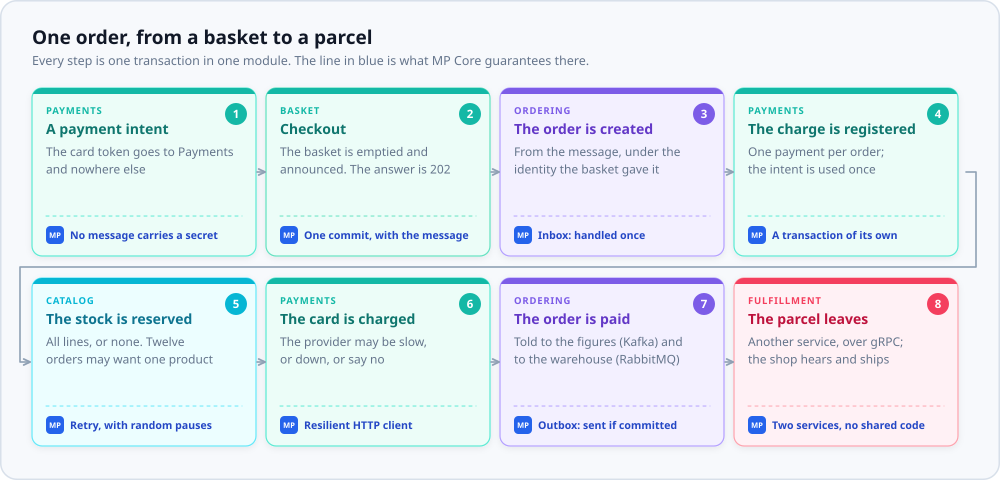

<div align="center">

# Storefront

**The MP Core sample: an online store you can run, read and take apart.**

Three backends behind a gateway, built with [MP Core](https://github.com/panahister/mpcore).<br>
Nothing is a mock-up: real tokens, real brokers, real databases, and twenty-two scenarios that prove it.

[](https://github.com/panahister/mpcore-storefront-sample/actions/workflows/ci.yml)
[](https://github.com/panahister/mpcore)
[](LICENSE)
[](global.json)

[Run it](#run-it) ·
[**Build with AI agents**](docs/building-with-ai-agents.md) ·
[Learning path](docs/learning-path.md) ·
[Architecture](docs/architecture.md) ·
[The business](docs/business.md) ·
[Variations](docs/variations.md) ·
[What building it taught](docs/lessons.md)

</div>

<picture>
  <source media="(prefers-color-scheme: dark)" srcset="docs/images/system-dark.svg">
  
</picture>

## Built with AI coding agents, and built for them

> **One task was given to Claude Code and to Codex, each with MP Core's skill and nothing else.**
> Both changed the same seven files, kept the architecture without being reminded, and said what they
> had not proved. [**Read the run, as it happened**](docs/building-with-ai-agents.md).

| | |
|---|---|
| Ten skills at the root, ten in every backend | for Claude Code (`.claude/skills`) and for Codex (`.agents/skills`), checked with both |
| What to type, for each skill | [docs/building-with-ai-agents.md](docs/building-with-ai-agents.md), section 5 |
| The task, both answers and both changes, unedited | [docs/agent-runs/2026-09-27](docs/agent-runs/2026-09-27) |
| The rules an agent holds to in this repository | [AGENTS.md](AGENTS.md), [CLAUDE.md](CLAUDE.md) |

## Why this sample exists

Most samples show the day everything works. A real backend is judged on the other days: the request
that arrives twice, the eight checkouts of one basket at the same moment, the payment provider that is
down, the message that is delivered again after a restart.

Storefront is built for those days. It is small enough to read in a day and complete enough to be true:

| You want to know | Storefront shows it | By running |
|---|---|---|
| Where does a business rule live, and what does a caller see when it is broken? | A rule is a named class, checked by the aggregate, answered under its own code, in the caller's language | S3, S13 |
| How does one module tell another, without sharing a transaction? | A message that commits with the change; the answer to the shopper is "accepted" | S1 |
| What happens when a request arrives twice? | It runs once, and the second answer is the first | S14 |
| What happens when eight requests arrive at once? | One order, one charge | S15, S16 |
| Who changed this price, and who tried and was refused? | An audit trail in the backend's own database, written in the commit of the change; a refused attempt is kept | S3 |
| Can a message be read in the caller's language, and changed without a release? | A key and its arguments become a text when it is shown; support edits a text while the backend runs | S13 |
| Where does a card token go, and where does it never go? | To Payments, and into no message, queue table or log line | S17 |
| How do two services work together with no shared code? | Each declares what it reads; a test holds the two together | S18 |
| How is a stream read by a service that was not there when it was written? | From its start, at its own pace, into a hypertable | S19 |
| What does a backend believe of the gateway in front of it? | The scheme and the address, if the gateway is trusted. Never who the caller is | S20 |
| If the gateway verifies tokens, may the backend stop? | No. The edge cannot know for which backend a token was issued, or what its holder may do | S21 |

## What is in it

| Backend | Shape | Transport | Messaging | Storage | Also |
|---|---|---|---|---|---|
| [`commerce/`](commerce) | modular monolith, four modules | REST and gRPC | Kafka and RabbitMQ | PostgreSQL | hybrid cache (memory and Redis), business audit, request idempotency, inbox, stored translations |
| [`fulfillment/`](fulfillment) | service | gRPC | RabbitMQ | PostgreSQL | business audit, inbox |
| [`analytics/`](analytics) | service | REST | Kafka | TimescaleDB hypertable | memory cache, inbox |

Around them, each a real product in a container: **Apache APISIX** at the edge, **Keycloak** for identity,
**Apache Kafka** and **RabbitMQ**, **PostgreSQL**, **TimescaleDB** and **Redis**, and **OpenTelemetry** with
Jaeger, Prometheus and Grafana. Only the payment provider is simulated.

The three backends share no code. Each declares the messages it reads in its own project, and a test
holds the copies together.

## One order, from a basket to a parcel

<picture>
  <source media="(prefers-color-scheme: dark)" srcset="docs/images/order-journey-dark.svg">
  
</picture>

Every box is one transaction that changes one module. Between the boxes there is a message, and each
message leaves with the change that caused it. The code of the whole journey is business: a rule, a
decision, a name. What makes it safe is MP Core's, and it is the same in all three backends.

## What the sample's code does, and what MP Core does

| The sample's code | MP Core |
|---|---|
| Says that a price may not move by more than half in one change | Reports the broken rule as 422, under the rule's code, with the numbers that broke it, in English or Persian; audits the refused attempt |
| Empties the basket and announces what it held | Saves both in one commit; releases the message only after it |
| Marks the checkout endpoint `RequireIdempotencyKey()` | Stores the key and the answer with the change; answers a repeat with the first answer |
| Declares which exception means "lost a race" | Retries with growing, random pauses; discards the messages of the attempt that failed |
| Names a role for an endpoint | Validates the token, refuses by default, names the actor in every audit record |
| Raises `OrderPaid` | Delivers it to Kafka after the commit, partitioned by the order; the reader's inbox stops a second delivery |
| Nothing | Traces that cross three services, metrics, logs without secrets, health that tells alive from ready |

## Run it

You need the .NET SDK `10.0.400`, Docker with about 8 GB of memory, `curl`, `jq` and `openssl`.
`grpcurl` is needed for the gRPC scenarios. [docs/running.md](docs/running.md) has the details, the
addresses you can open, and the problems people meet.

```bash
git clone https://github.com/panahister/mpcore-storefront-sample.git
```

```bash
cd mpcore-storefront-sample
```

```bash
scripts/up.sh
```

```bash
scripts/setup.sh
```

Then each backend in a terminal of its own:

```bash
scripts/run.sh commerce
```

```bash
scripts/run.sh fulfillment
```

```bash
scripts/run.sh analytics
```

And the twenty-two scenarios, against the running system:

```bash
scripts/scenarios.sh
```

Every step prints what it expects and what it got. The script is a demonstration and an end-to-end test
at the same time: it exits non-zero when an expectation fails.

## One branch, and switches

Everything is on `main`, and everything on `main` runs on every change. What you choose is a switch:

| You want | Switch | Default |
|---|---|---|
| The edge to verify tokens with Keycloak, as a second wall | `EDGE_AUTH=keycloak scripts/up.sh` | `off` |
| MP Core from nuget.org, or from a clone next to this repository | `-p:MPCoreSource=NuGet` or `Local` | decided by what is there |
| A lighter run, without the observability stack | `scripts/up.sh --no-observability` | with |

[docs/variations.md](docs/variations.md) says what each changes, what it does not, and which scenario
proves it.

## Learn from it

| You want to | Read |
|---|---|
| Follow a path through the code, one idea at a time | [docs/learning-path.md](docs/learning-path.md) |
| Build here, or on MP Core, with Claude Code or Codex | [docs/building-with-ai-agents.md](docs/building-with-ai-agents.md) |
| Know the business: roles, rules, scenarios, API | [docs/business.md](docs/business.md) |
| Know why the system is cut this way, and what each decision costs | [docs/architecture.md](docs/architecture.md) |
| Find where a capability of MP Core is used | [docs/mpcore-coverage.md](docs/mpcore-coverage.md) |
| Know what building this taught, including what went wrong | [docs/lessons.md](docs/lessons.md) |
| Choose a variation | [docs/variations.md](docs/variations.md) |
| See the whole platform, part by part | [MP Core: reference architecture](https://github.com/panahister/mpcore/blob/main/docs/architecture/reference-architecture.md) |
| Start a backend of your own | [MP Core: getting started](https://github.com/panahister/mpcore/blob/main/docs/guide/getting-started.md) |

Each backend also carries the guide the MP Core template generated for it (`README.md` and `docs/` inside
`commerce/`, `fulfillment/` and `analytics/`). Those describe a generated backend in general; the documents
above describe this system.

## Proved by running it

| What | Command | Needs |
|---|---|---|
| Commerce: rules, handlers, validators, messages, architecture, the EF model | `dotnet test commerce/Storefront.Commerce.Backend.sln` | nothing |
| Fulfillment | `dotnet test fulfillment/Storefront.Fulfillment.Backend.sln` | nothing |
| Analytics | `dotnet test analytics/Storefront.Analytics.Backend.sln` | nothing |
| The contracts between the three | `dotnet test tests/Storefront.Contracts.Tests` | nothing |
| Every business scenario, end to end | `scripts/scenarios.sh` | the dependencies and the three backends |
| All of it against packed MP Core packages | `scripts/verify-against-packages.sh` | a clone of MP Core next to this repository |

The tests and the scenarios run on GitHub on every change to this repository.
[docs/lessons.md](docs/lessons.md) lists what they found: defects in MP Core, which were fixed in MP Core,
and mistakes in this sample's own design, which are the ones a team is most likely to repeat.

## Where MP Core comes from

From nuget.org, version `0.9.0`. When a clone of MP Core sits next to this repository (`../mpcore`), the
backends build against its source instead: a breakpoint in framework code works, and a change there is
picked up by the next build. [`Directory.Build.targets`](Directory.Build.targets) decides, and says so in
the build output. To choose for one build:

```bash
dotnet build commerce/Storefront.Commerce.Backend.sln -p:MPCoreSource=NuGet
```

## Licence and marks

Apache-2.0. See [LICENSE](LICENSE) and [NOTICE](NOTICE). Storefront, DemoPay and the people in the
scenarios are fictional. The names and marks of the products in the pictures belong to their owners and
are used only to name those products.
